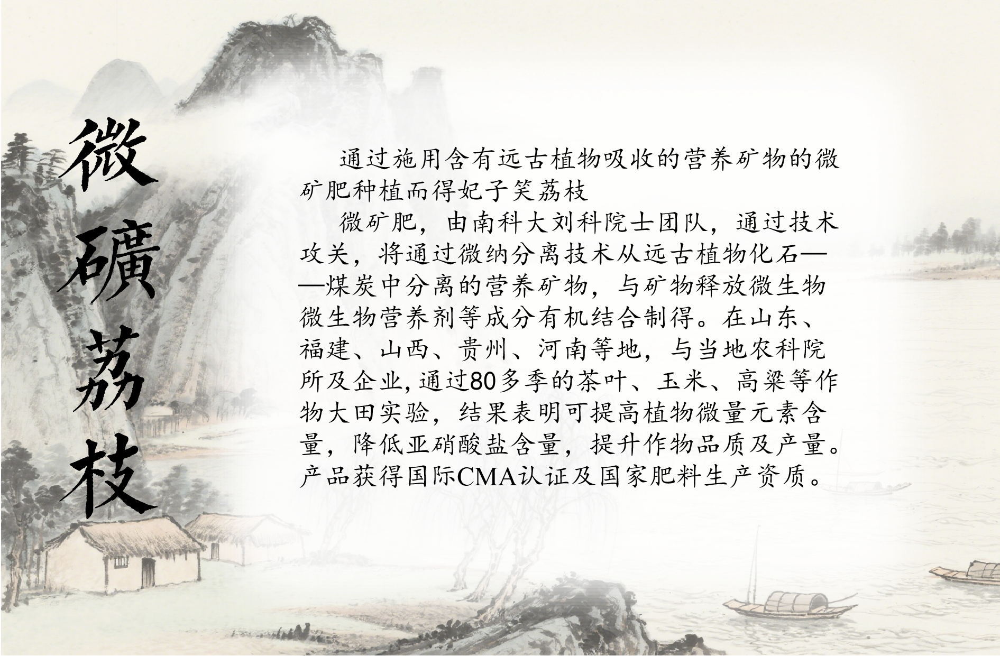
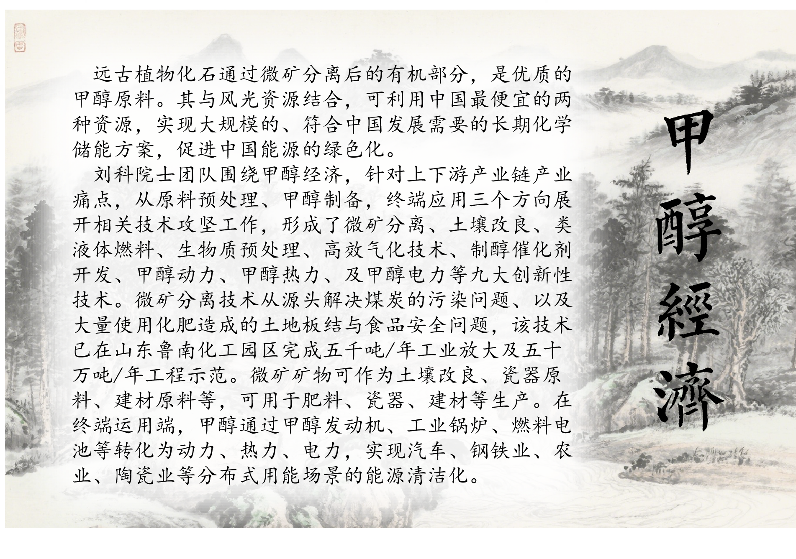

品名：礼知荔-微矿荔枝

等级：一    级

产地：深圳南山

贮存条件：避光、干燥、冷鲜

最佳食用时间：3天

微矿荔枝
======
  通过施用含有远古植物吸收的营养矿物的微矿肥种植而得正山小种

  微矿肥，由南科大刘科院士团队，通过技术攻关，将通过微纳分离技术从远古植物化石——煤炭中分离的营养矿物，与矿物释放微生物，微生物营养剂等成分有机结合制得。在山东、福建、山西、贵州、河南等地，与当地农科院所及企业，通过80多季的茶叶、玉米、高粱等作物大田实验，结果表明可提高植物微量元素含量，降低亚硝酸盐含量，提升作物品质及产量。产品获得国际CMA认证及国家肥料生产资质。
  

甲醇经济
======
  远古植物化石通过微矿分离后的有机部分，是优质的甲醇原料。其与风光资源结合，可利用中国最便宜的两种资源，实现大规模的、符合中国发展需要的长期化学储能方案，促进中国能源的绿色化。

  刘科院士团队围绕甲醇经济，针对上下游产业链产业痛点，从原料预处理、甲醇制备，终端应用三个方向展开相关技术攻坚工作，形成了微矿分离、土壤改良、类液体燃料、生物质预处理、高效气化技术、制醇催化剂开发、甲醇动力、甲醇热力、及甲醇电力等九大创新性技术。微矿分离技术从源头解决煤炭的污染问题、以及大量使用化肥造成的土地板结与食品安全问题，该技术已在山东鲁南化工园区完成五千吨/年工业放大及五十万吨/年工程示范。微矿矿物可作为土壤改良、瓷器原料、建材原料等，可用于肥料、瓷器、建材等生产。在终端运用端，甲醇通过甲醇发动机、工业锅炉、燃料电池等转化为动力、热力、电力，实现汽车、钢铁业、农业、陶瓷业等分布式用能场景的能源清洁化。
 

